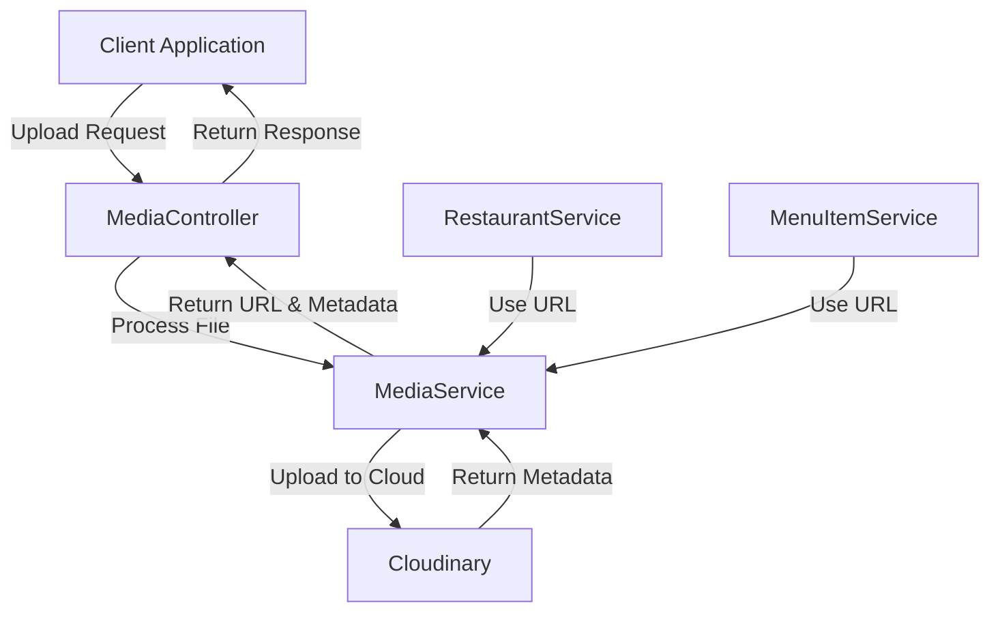

# Media Upload System Documentation

## Overview

The Restaurant E-Commerce Hub implements a comprehensive media management system for handling image uploads, storage, retrieval, and transformations. The system uses Cloudinary as the cloud-based media management service to efficiently store and deliver media assets.

## Architecture

The media system follows a clean, domain-driven design architecture:

## Components

### 1. MediaService

The core service that handles all interactions with Cloudinary:

- **Configuration**: Initializes with Cloudinary credentials from environment variables
- **Upload**: Converts file buffers to base64 and uploads to Cloudinary
- **Metadata Retrieval**: Gets detailed information about existing media
- **Deletion**: Removes files from Cloudinary
- **Transformation**: Generates URLs with transformation parameters

### 2. Controllers & Routes

Exposes RESTful endpoints for media operations:

- `POST /media/upload`: Upload a new file
- `GET /media/:publicId/metadata`: Retrieve metadata for a file
- `DELETE /media/:publicId`: Delete a file

### 3. Integration Points

The media system integrates with other domains:

- **Restaurant Domain**: For restaurant profile images
- **Menu Item Domain**: For menu item images, including multiple images per item

## Configuration

### Environment Variables
